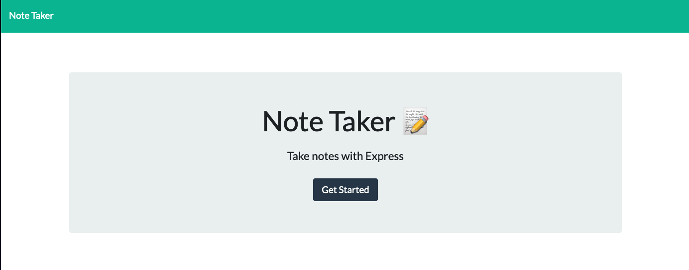
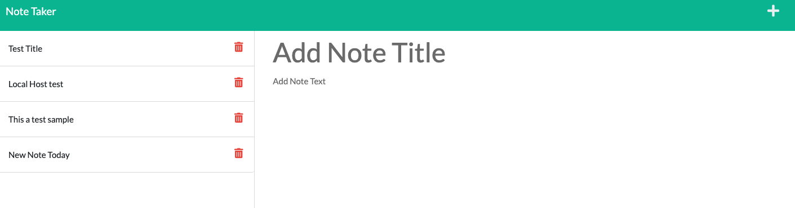
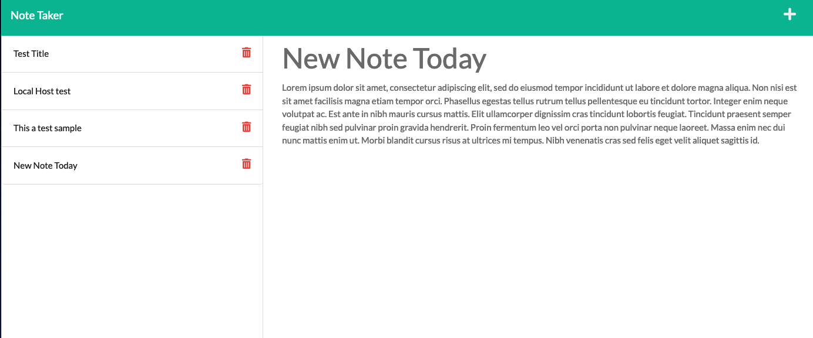

# Note Taker
[](https://opensource.org/licenses/MIT)

## Description
Application that can be used to write and save notes using Node.js and Express. It was deployed on the Heroku app. I enjoyed working on it while building up on my back end coding skills. Building the routes and parsing the JSON data was challenging. I was able to use Insomia to test out the routes before deploying. I think for my next version, I would like to alter the design of the site and allow the notes to be edited after saving. 

## Table of Contents

- [Installation](#installation)
- [Usage](#usage)
- [Contributing](#contributing)
- [Tests](#tests)
- [Screenshots](#screenshots)
- [License](#license)
- [Questions](#questions)
- [Acknowledgments](#acknowledgments)

### Installation
None. Visit deployed site at https://edgars-note-taker.herokuapp.com/

### Usage
Click on the Get Started button. View notes on the left column or click on note on the right to type a new note. Save note by clicking the save icon. Click on plus to start a new note. Click on the trashcan icon to delete. 

### Contributing
Feel free to fork or clone this repo and make your own versions.

### Tests
None.

###  Screenshots 




###  License

Copyright &copy; 2021 Edgar Ortega

This project is licensed under the terms of the <a href="https://opensource.org/licenses/MIT" target= "_blank" > MIT </a> license.

### Questions

Send questions to edort93@gmail.com or visit <a href="https://github.com/edgarO93" target= "_blank" >my profile </a><br>

### Acknowledgments

```
I would like to thank online resources such as W3 schools, MDN Web Docs, and Stack Overflow.
```
